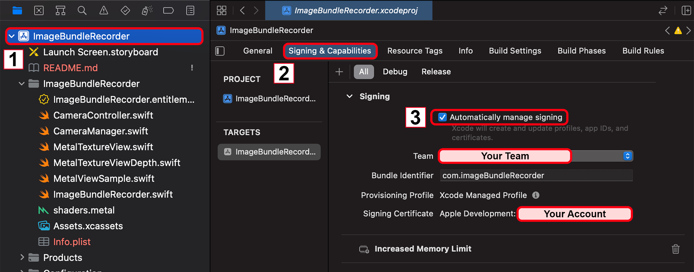
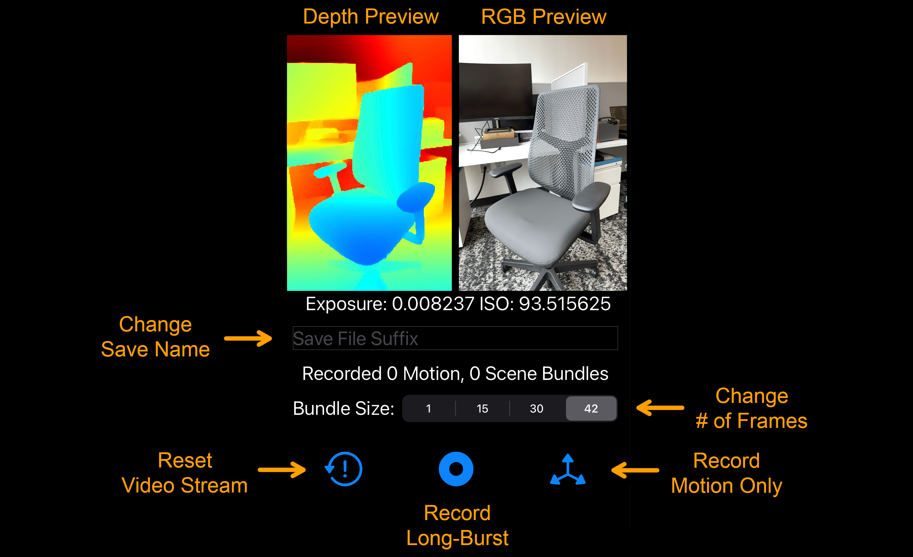
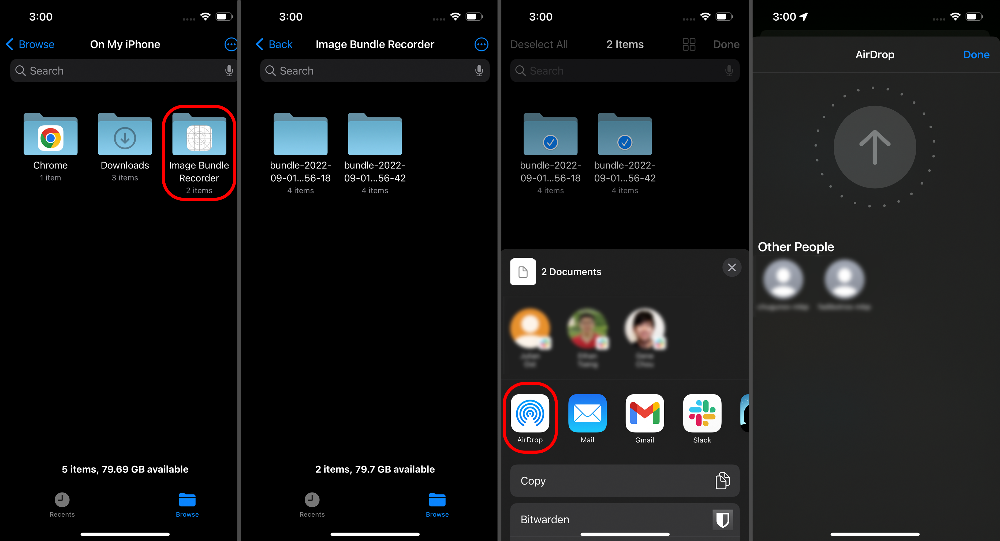

# iOS App for RAW Long-Burst Recording

This app is part the official code repository for the work: [Shakes on a Plane: Unsupervised Depth Estimation from Unstabilized Photography](https://light.princeton.edu/publication/soap/)

If you use parts of this work, or otherwise take inspiration from it, please considering citing our paper:
```
@article{chugunov2022shakes,
  title={Shakes on a Plane: Unsupervised Depth Estimation from Unstabilized Photography},
  author={Chugunov, Ilya and Zhang, Yuxuan and Heide, Felix},
  journal={arXiv preprint arXiv:2212.12324},
  year={2022}
}
```

The code is partially derived from [this sample code for recording depth with AVFoundation](https://developer.apple.com/documentation/avfoundation/additional_data_capture/capturing_depth_using_the_lidar_camera). We highly recommend you read through that example to familiarize yourself with the structure and function of portions of this app.

## Getting the App Running
1. Open the `.xcodeproj` project file with Xcode (tested for Xcode 14).
2. Click on the project and select `Signing & Capabilities` to provision the app. You'll have to make an [Apple developer account](https://developer.apple.com/) if you don't have one already. Check the `Automatically manage signing` box, select your team (likely your personal Apple developer account), and you should be done.



3. Plug in your device (in our case an iPhone 14 Pro), and trust it. It should appear in the list of devices at the top of Xcode. Select it as the device to build/deploy to.
4. Press the play button at the top of Xcode to build the app, its icon should now appear on your phone.
5. As this is an app not from the app store, you will have to trust the developer in your settings under `Settings / General / VPN & Device Management` (This location may depend on your iOS version).


6. You should now be able to run the app.

## Using the App



1. Enter a suffix (or leave blank). Captured long-burst data will be saved into folders named `bundle-{capture_time}-{suffix}`.
2. Use the sliding bar to select how many frames to record per capture: 1, 15, 30, or 42. The app records at ~21 fps, so the longest recording length is approximately 2 seconds.
3. Left button resets the video stream. Middle button captures a long-burst with RAW, RGB, Depth, and motion (gyro/accelerometer) data. Right button records only motion data.
4. If the recording was sucessful, a message will pop up stating the device is "Saving Data to Disk". Otherwise an error message will appear and no data will be written to the device.
5. If the video stream stops or appears to have high latency, try restarting the app and closing other apps that may be taking up phone memory.
6. ! **careful** ! : This app records completely uncompressed 14-bit, 12-megapixel RAWs; so a 42-frame recording is like 2 gigabytes of data. It's really easy to quickly fill up your phone's entire storage, so remember to delete unneeded captures and empty the `Recently Deleted` folder.

## Processing the Recorded Long-Bursts
1. Airdrop is the easiest way to move recorded long-burst bundles from the phone to your computer. Navigate in the `Files` app to `On My iPhone` and you should see an `Image Bundle Recorder` folder. Then select and airdrop the desired data to your device:



2. Place all these bundles into a folder, and convert them to `.npz` dictionaries with:
```python ConvertBinaries.py -d {folder_containing_bundles}```. This will populate the parent directory with folders containing the processed `.npz` data and preview first/last images of the recorded data.

3. See [0_data_format.ipynb](https://github.com/princeton-computational-imaging/SoaP/blob/main/0_data_format.ipynb) in the main repo to understand what's inside this `.npz` data and [1_reconstruction.ipynb](https://github.com/princeton-computational-imaging/SoaP/blob/main/1_reconstruction.ipynb) to learn how to train a SoaP model with it.

Best fishes,  
Ilya

