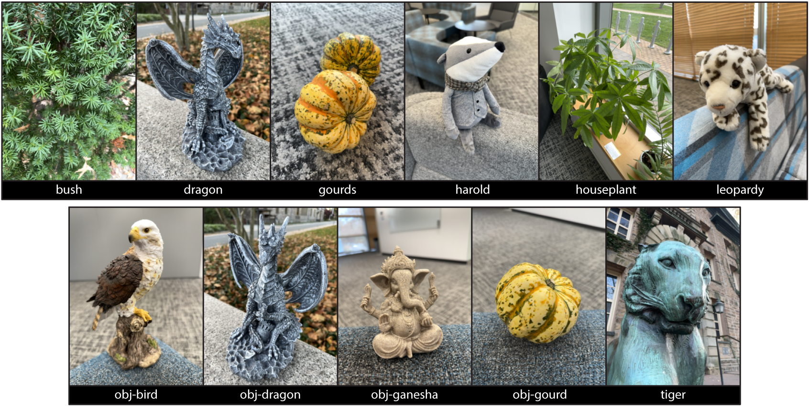
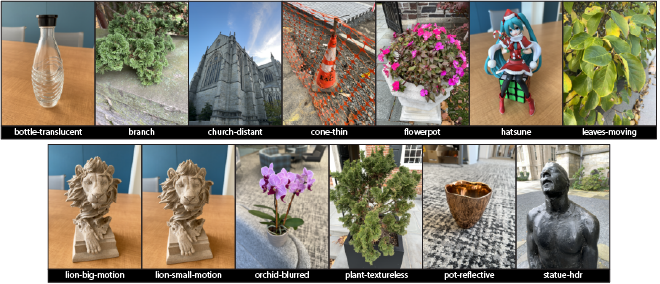
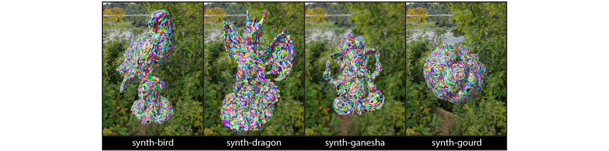

# Shakes on a Plane: Unsupervised Depth Estimation from Unstabilized Photography
<a href="https://colab.research.google.com/github/princeton-computational-imaging/SoaP/blob/main/tutorial.ipynb" style="text-decoration: none;">
  
</a>


This is the official code repository for the work: [Shakes on a Plane: Unsupervised Depth Estimation from Unstabilized Photography](https://light.princeton.edu/publication/soap/), presented at CVPR 2023.

If you use parts of this work, or otherwise take inspiration from it, please considering citing our paper:
```
@InProceedings{Chugunov_2023_CVPR,
    author    = {Chugunov, Ilya and Zhang, Yuxuan and Heide, Felix},
    title     = {Shakes on a Plane: Unsupervised Depth Estimation From Unstabilized Photography},
    booktitle = {Proceedings of the IEEE/CVF Conference on Computer Vision and Pattern Recognition (CVPR)},
    month     = {June},
    year      = {2023},
    pages     = {13240-13251}
}
```

## Requirements:
- Developed using PyTorch 1.13.0 and PyTorch Ligthning 1.8.3 on Linux x64 machine
- Condensed package requirements are in `\requirements.txt`. Note that this contains the exact package versions at the time of publishing. Code will likely work with newer versions of the libraries, but you will need to watch out for changes in class/function calls.

This code also requires tiny-cuda-nn, see [NVlabs/tiny-cuda-nn](https://github.com/NVlabs/tiny-cuda-nn) for installation instructions (we used Version 1.6 at the time of publishing).

## Project Structure:
```cpp
SoaP
  ├── checkpoints  
  │   └── // folder for network checkpoints
  ├── config
  │   ├── config_depth.json  // depth MLP configuration
  │   └── config_rgb.json // image MLP configuration
  ├── data  
  │   └── // folder for long-burst data
  ├── utils  
  │   └── utils.py  // network helper functions (e.g. camera projection, spline interpolation)
  ├── tutorial.ipynb  // interactive tutorial for training and depth reconstruction
  ├── README.md  // <- You Are Here
  ├── requirements.txt  // frozen package requirements
  └── train.py  // dataloader, network, visualization, and trainer code
  ```
## Getting Started:
We recommend you start by going through `tutorial.ipynb` to download a sample long-burst and familiarize yourself with the data contained within it and how to train a model with it. This tutorial is also available as a [Colab notebook](https://colab.research.google.com/github/princeton-computational-imaging/SoaP/blob/main/tutorial.ipynb).

For other training arguments, see the argument parser section of `\train.py`.

## Data:
You can download the long-burst data used in the paper (and extra bonus scenes) via the following links:

1. Shade map used for lens shading compensation (**important**, see paper supplemental for more information): [shade_map.npy](https://soap.cs.princeton.edu/shade_map.npy)  

 2. Main scenes: [scenes.zip](https://soap.cs.princeton.edu/scenes.zip)
 
Model checkpoints: [scenes-checkpoints.zip](https://soap.cs.princeton.edu/scenes-checkpoints.zip)  
These checkpoints may require you to download the full scene data in order to properly load them.

 3. Supplemental experiment scenes: [experiments.zip](https://soap.cs.princeton.edu/experiments.zip)
 

 4. Extra un-used (but neat) scenes: [extra.zip](https://soap.cs.princeton.edu/extra.zip)
 

 5. Synthetic rendered data (with scanned object meshes): [synthetic.zip](https://soap.cs.princeton.edu/synthetic.zip)

 

We recommend you unzip these folders and place them into `\data`

## App:
Want to record your own long-burst data? See [!App](https://github.com/princeton-computational-imaging/SoaP/tree/main/!App) for details!


Good luck have fun,  
Ilya
